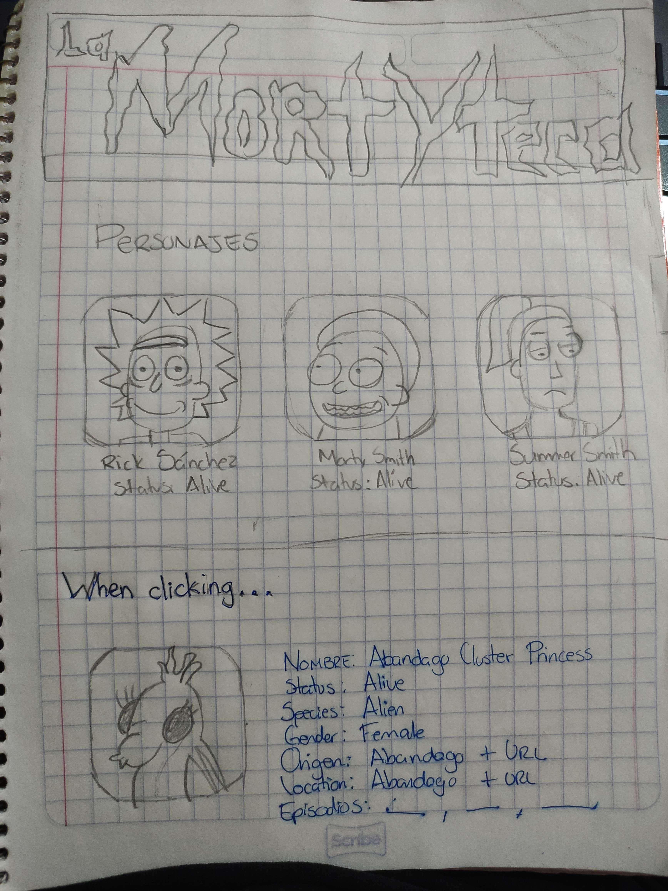
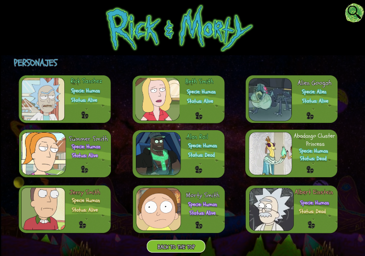
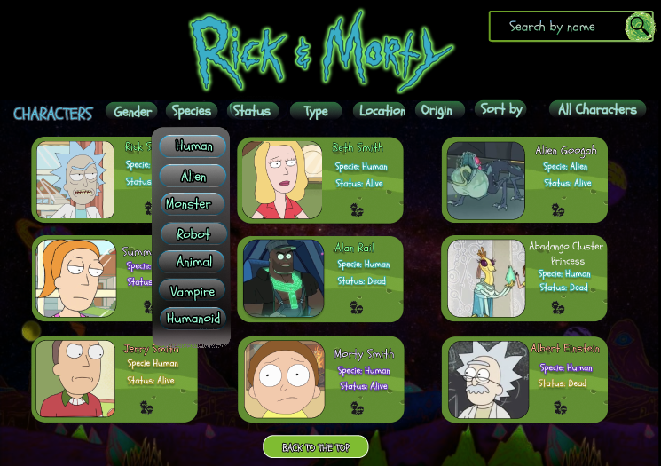
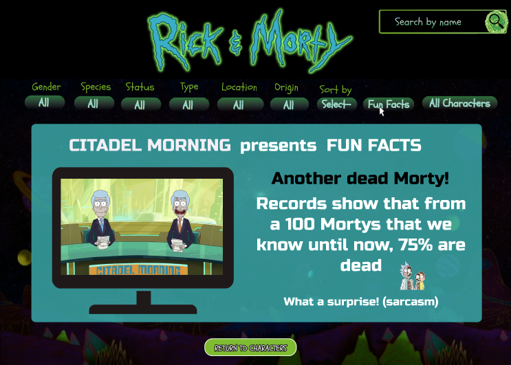

# Rick and Morty

## Índice

* [1. Resumen del proyecto](#1-resumen-del-proyecto)
* [2. Investigación UX](#2-investigación-ux)
* [3. Primer prototipo en papel](#3-primer-prototipo-en-papel)      
* [4. Imagen de prototipo alta fidelidad ](#4-imagen-de-prototipo-alta-fidelidad)
* [5. Imagen final de prototipo alta fidelidad ](#5-imagen-final-de-prototipo-alta-fidelidad)
* [6. Imagen adicional a Fun Facts](#6-imagen-adicional-a-fun-facts)

***

## 1. Resumen del proyecto
La temática del proyecto es sobre la famosa serie estadounidense de animación 
para adultos: Rick & Morty. La página web contiene todos los personajes de la serie, 
características personales de cada personaje, filtrado por género, especie, status, 
tipo, origen, lugar. Se incluyó un buscador para facilitar al usuario encontrar con 
facilidad un personaje específico. También podrán encontrar una sección que incluye 
ordenado alfabético de A-Z / Z-A, así como datos curiosos sobre la serie. 

## 2. Investigación UX

La página web está dirigida a todas las personas (Fandom) interesadas en la serie Rick & Morty, 
que gusten conocer más sobre sus personajes favoritos, adentrarse en las diferentes dimensiones y 
particularidades de todos los personajes. El usuario podrá desplazarse por toda la página, sin
problema alguno, ya que es amigable y ágil.

## Diseño de la Interfaz de Usuario

## 3. Primer prototipo en papel
Se realizaron dos prototipos en papel, y se solicitó feedback a compañeras y coaches sobre ambos diseños.

## 4. Imagen de prototipo alta fidelidad
A partir de los comentarios recibidos, se mezclaron detalles de ambos prototipos para posteriormente plasmarlos en figma.

## 5. Imagen final de prototipo alta fidelidad
Durante el desarrollo del proyecto, agregamos más detalles al prototipo y solicitamos feedback sobre lo realizado, 
con el objetivo de que la página fuese lo más amigable para el usuario.

## 6. Imagen adicional a Fun Facts
Al acercarnos al final del proyecto, decidimos agregar una sección de datos curiosos e incluyendo estadísticas, sobre ciertos datos peculiares de los personajes principales.

 
